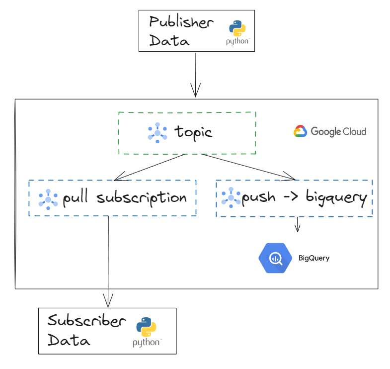

# Data Pipeline Using GCP PubSub
This is repository for data pipeline using GCP Pubsub. This repository do publisher and subscriber using python client





## Run Locally

Clone the project

```bash
  git clone https://github.com/arigofahreza/gcp-pubsub
```

Go to the project directory

```bash
  cd gcp-pubsub
```

Install dependencies

```bash
  pip install -r requirements.txt
```

Start the job

```bash
  python3 main.py
```